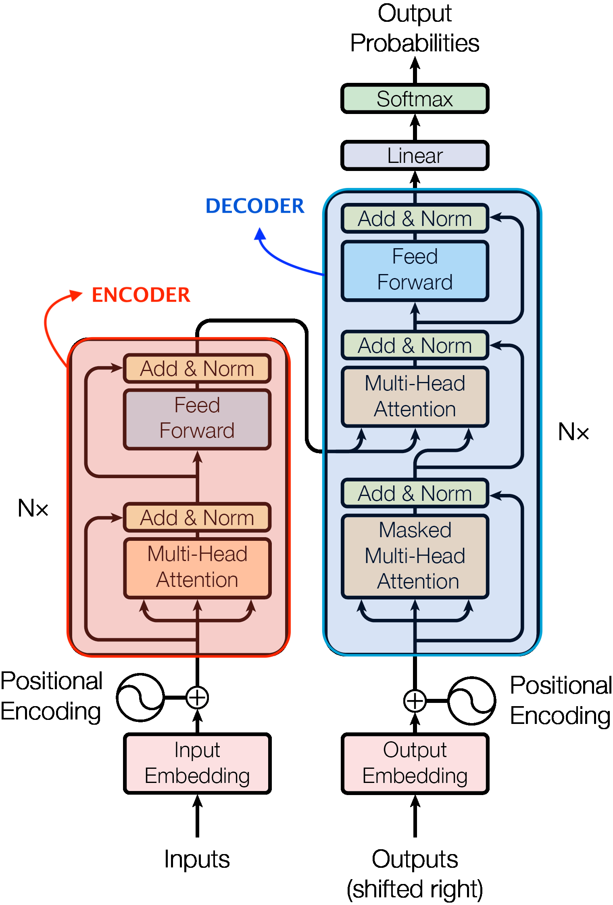
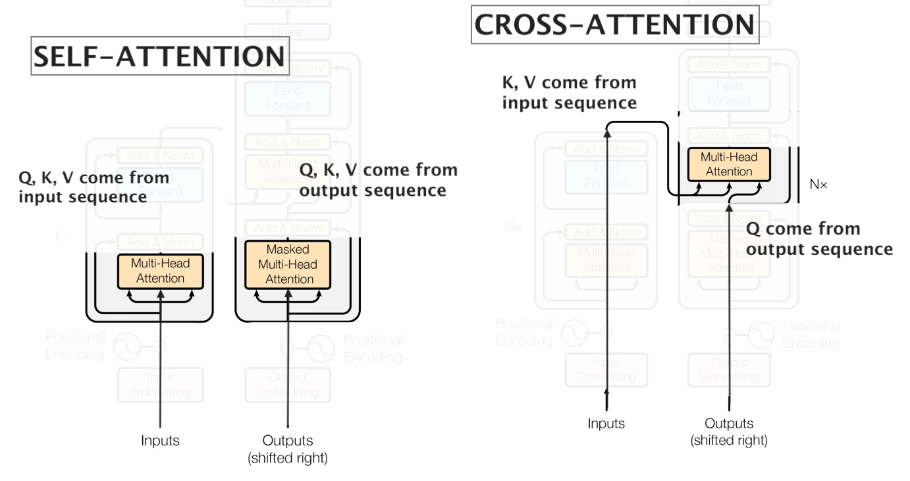
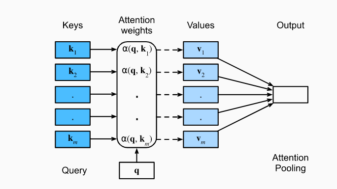

---
output:
  pdf_document: default
  html_document: default
---

# Transformers  

### by Ignacio Cordova Pou

1. Introduction 
  
    1.1. Where does the hype come from?

    1.3. What problems does it solve?

2. The Transformer in machine translation

    2.1. Encoder-Decoder architecture

    2.2. Attention mechanism

    2.3. The Transformer step by step

3. The Transformer in computer vision 

  

\pagebreak

## 1. Introduction
### 1.1. Where does the hype come from?

The transformer architecture has revolutionized the world of Artificial Intelligence since it was first presented to the world in the paper "Attention is all you need" by Vaswani et al. in 2017. The main reason for this is that it has been able to achieve state of the art results in a wide variety of tasks, such as machine translation, speech recognition, image captioning, etc.  

During the last years, the Transformer architecture has been applied to a wide variety of tasks and projects. Some of them are:

- BERT, a language model that has been able to achieve state of the art results in a wide variety of NLP tasks. 
- GPT-3, a language model that has been able to generate text that is indistinguishable from human written text.
- Github Copilot, a language model that has been able to generate complex code forom simple prompts.
- Protein folding has been a problem that has been unsolved for decades. The Transformer architecture has been able to provide the best solution so far to this problem. 
- Tesla Autopilot uses a Transformer architecture to convert the raw data from the cameras into a representation that is easier to understand for the neural network. 

I hope this gives you an idea of the impact that the Transformer architecture has had in the world of Artificial Intelligence. In this article, I will try to explain the Transformer architecture in a simple way and I will try to explain the main concepts that are needed to understand it. 

### 1.2. What problems does it solve?

The Transformer architecture is a general architecture that can be applied to a wide variety of tasks. However, it is important to understand the problems that it solves in order to understand why it is so powerful. Knowing that it was born for Natural Language Processing (NLP) we can lay out the problems that it solves in this context. 

The first problem that it solves is the problem of long term dependencies. In NLP, we usually deal with sequences of words. For example, in the sentence "The dog stayed at home because it was tired" we have a sequence of words. The problem is that the meaning of a word is not only related to the word that is next to it. For example, the word "tired" is related to the word "dog" but it is not in the immediate context of the word. That is what a long term dependency is. It is hard for RNNs or even LSTMs to capture long term dependencies since they have no direct acces to the information that is far away in the sequence. In other words, the information of "dog" has to travel al long way through multiple connections until it is required. We will see that the Transformer architecture solves this problem by using attention and allowing the decoder to access the information of the encoder at any point in the sequence. 

The mechanism of attention also allows for parallel processing. In RNNs, the information has to travel through the network sequentially. In the Transformer architecture, the information can travel in parallel. This allows for faster processing particularly in the case of long sequences. Besides that, we all like parallelization, don't we?  

Interpretability is another curtial and sometimes overlooked problem. Hidden states of both RNNs and Transformers are hard to interpret. However, the Transformer architecture provides attention scores that can be used to understand which parts of the input are more important for the output. This can be understood as what is the architecture paying attention to when making predictions. 

\pagebreak
## 2. The Transformer in machine translation

The paper "Attention is all you need" by Vaswani et al. is the paper that introduced the Transformer architecture to the world. In this section, I will try to explain the main concepts of the paper. 

First I will dive in the encoder-decoder architecture. Then I will explain the attention mechanism and how it is used in the Transformer architecture. Finally, I will explain the Transformer architecture step by step. Note that the Transformer was presented to solve the sequence-to-sequence machine translation problem. Therefore, I will introduce concepts in the context of this problem. However, the Transformer architecture is a general architecture that can be applied to a wide variety of tasks.

### 2.1. Encoder-Decoder architecture

The encoder-decoder architecture is a general architecture that has been used for decades. It is composed of two parts: an encoder and a decoder. The encoder is used to encode the input into a representation that is easier to understand for the decoder. The decoder is used to decode the representation into the output. For example, in the case of machine translation, the encoder would encode the input sentence into a representation that is easier to understand for the decoder. The decoder would then decode the representation into a translated sentence. 

{height="300" width="200"}

Transformers are a special case of encoder-decoder architectures. Imagine we had an encoder that could capture information about the context of the input. Not only local information (like CNNs do with images) but also information about the global context. Imagine that we could use this information to decode the input into the output taking advantage of the relationships between different elements of both the input and the output. The attention mechanism used by the Transformer architecture allows us to do exactly that. The problem we are trying to solve is to find an adequate representation of the input that contains information about the relationships between the different elements of the input. In a similar way, the output would contain information about the relationship between different elements of both the input and the output.

### 2.2. Attention mechanism

This is a key concept of the Transformer architecture. Please read this section carefully and make sure you understand it. We will focus in sequence to sequence problems, concretly in machine translation.

I stated that the problem we are trying to solve is to find an adequate representation of the input that contains information about the context. We can think of the context as the relationships between the different elements of the input. For example, in the sentence "The dog stayed at home because it was tired", when encoding the word "tired", we want to take into account the presence of the word "dog" in the sentence. In other words, we want to pay attention to the word "dog" when encoding the word "tired". How is this achieved? By using self-attention. 

From now one we must regard the words as embedded into a vector space so that we have a vector representation of each word. In "Transformer terminology" we refer to these vectors as embeddings and in this particular problem, the words would be our tokens. In the paper, one can read the following: "... we use learned embeddings to convert the input tokens and output tokens to vectors of dimension $d_{model} = 512$". It is common for the embeddings to be learnable and to change during training as the model learns. It is important to note that this embeddings are context-independent, meaning that the word "dog" will always be represented by the same vector. We will see later that information about the position of the word in the sentence is captured by the positional encoding and that information about the context is captured by the attention mechanism. 

#### 2.2.1. Self-attention

Self-attention refers to attending to other elements of the same sequence. Let's look at the sentence "The dog stayed at home because it was tired". We can represent this sentence as a sequence of vectors. In this case, the sequence would be the following:

$$
x_1 = \text{The} \ x_2 = \text{dog} \ x_3 = \text{stayed} \ x_4 = \text{at} \ x_5 = \text{home} \ x_6 = \text{because} \ x_7 = \text{it} \ x_8 = \text{was} \ x_9 = \text{tired}
$$

In order to build a new representation $z_9$ for the word $x_9 = \text{tired}$, we use a weighted average of the words that are in the context of the word "tired". 

$$
z_9 = w_1 \cdot x_1 + w_2 \cdot x_2 + w_3 \cdot x_3 + w_4 \cdot x_4 + w_5 \cdot x_5 + w_6 \cdot x_6 + w_7 \cdot x_7 + w_8 \cdot x_8 + w_9 \cdot x_9
$$

The weights $w_i$ are the attention scores. We would like to find the weights $w_i$ such that the representation $z_9$ contains information about the context of the word "tired" in that specific sentence. The attention mechanism consists of three learnable matrices: $W^Q$, $W^K$ and $W^V$. These matrices are used to compute the query, key and value vectors of each input $x_i$ vector. 

Continuing with the example, we can compute the query, key and value vectors for the word "tired" as follows:

$$
\begin{aligned}
q_9 &= W^Q \cdot x_9 \ ; \ \ 
k_9 &= W^K \cdot x_9 \ ; \ \ 
v_9 &= W^V \cdot x_9
\end{aligned}
$$

Next, the querie $q_9$ "asks" the keys $[k_1 , \dots, k_9]$ which values should the model pay attention to. This is done by computing the dot product between the query vector $q_9$ and the key vector of each word in the sentence, scaling the results by $1/\sqrt{d_k}$ and applying the softmax function. The result is the attention score $w_i$ for each word $x_i$ in the sentence. This attention score is used to compute the weighted average using the value vectors $v_i$. 

$$
z_9 = w_1 \cdot v_1 + w_2 \cdot v_2 + w_3 \cdot v_3 + w_4 \cdot v_4 + w_5 \cdot v_5 + w_6 \cdot v_6 + w_7 \cdot v_7 + w_8 \cdot v_8 + w_9 \cdot v_9
$$ 

The Transformer will learn the transformations necessary to assign high values to $w_9$ and $w_2$ (which multiplies the value $v_2 = W^V \cdot x_2$ associated to the word "dog") and low values to the rest of the weights. This way, the representation $z_9$ will contain information about the context of the word "tired" in that specific sentence. For example, oversimplifying the result: 

$$
z_9 \sim  0.3 \cdot v_2 + 0.7 \cdot v_9 
$$ 

#### 2.2.2. Cross-attention

Cross-attention refers to attending to elements of a different sequence. In the previous section, we saw how the Transformer uses self-attention to compute the representation of a word in a sequence. In the case of machine translation, we want to compute the representation of a word in the target sequence using context and information about the input sentece. This is done by using cross-attention. 

Given the sentence "The dog stayed at home because it was tired" it translates to "El perro se quedó en casa porque estaba cansado". If we want the decoder to be able to ouput the word "cansado", its abstract representation should contain information about not only the word "tired" but also the word "dog", for example, to capture gender information from the input sentence. This is achieved by using the queries computed by the decoder (coming from the output sequence) to dot-product them with the keys computed by the encoder (coming from the input sequence). 

The illustrations presented by the authors use black arrows to represent the queries Q, the keys K and the values V used to compute the attention scores and the contextualized representations of the tokens. A close look to where the arrows come from reveals wether the attention is self-attention or cross-attention.

\pagebreak

### 2.3. The Transformer step by step

#### 2.3.1. Inputs and outputs

The Transformer takes as input a sequence of tokens. This tokens can be letters, words, subwords and even image patches, depending on the problem we are trying to solve. The output of the Transformer varies also depending on the problem. In the case of machine translation the outputs are the words of the translated sentence. Note that the ouput that has been generated so far is used by the decoder to predict the next word.

#### 2.3.2. Embeddings

The first step is to convert the input tokens into vectors. This is done by using the embeddings. The embeddings can be learnable or one could use pre-trained embeddings.

#### 2.3.3. Positional encoding

Note that from what we have seen so far, the Transformer does not have any notion of the order of the words in the input sequence. This is a problem because the order of the words is important in many tasks. The authors solve this problem by adding a positional encoding to the embeddings. The positional encoding is a vector of the same size as the embeddings where the value of each element is a function of the position of the word in the sequence. This way, if a sentence contains the word "it" twice, for example, the embedding+positional encoding of the first "it" will be different from the embedding+positional encoding of the second "it". 

#### 2.3.4. Multi-head attention

Let's first focus on a single head attention. As we saw in section *2.2.1. Self-attention* the attention mechanism consists of three learnable matrices: $W^Q$, $W^K$ and $W^V$. These matrices are used to compute the query, key and value vectors of each input $x_i$ vector. The key is that the process to compute the socres and the weights of the weighted sum (the new representation of each input token) is easily parallelizable. The first step is to stack the words in a matrix X: 

$$
X = \begin{bmatrix}
\dots x_1 \dots \\
\dots x_2 \dots \\
\vdots \\
\dots x_n \dots
\end{bmatrix}
$$

The next step is to compute the query, key and value vectors for each word in the sequence. This is done by multiplying the matrix X by the matrices $W^Q$, $W^K$ and $W^V$ respectively.

$$
\begin{aligned}
Q &= X \cdot W^Q \ ; \ \
K &= X \cdot W^K \ ; \ \
V &= X \cdot W^V
\end{aligned}
$$

{height="200" width="300"}

The next step is to compute the attention scores. This is done by computing the dot product between the query vector $q_i$ and the key vector of each word in the sentence, scaling the results by $1/\sqrt{d_k}$ and applying the softmax function. The result is the weights $w_i$ for each word $x_i$ in the sentence. This attention score is used to compute the weighted average using the value vectors $v_i$.

$$
Attention(Q,K,V) = softmax(\frac{QK^T}{\sqrt{d_k}}) \cdot V
$$ 

When talking about multihead attention, the authors are referring to the fact that we can compute multiple attention heads in parallel. One possible interpretation is that this allows the trasnformer to pay "different kinds of attention" using each one of its heads. In practice, we can train in parallel $W_i^Q$, $W_i^K$ and $W_i^V$ for each head $i$. In the paper the authors use $h=8$ heads and the resulting matrices are concatenated and multiplied by a learnable matrix $W^O$ to obtain the final representation of the input sequence.

$$
MultiHeadAttention(Q,K,V) = Concat(head_1, \dots, head_h) \cdot W^O
$$
$$
head_i = Attention(Q_i, K_i, V_i)
$$

Note: this is a slightly different notation that the one used in the papers.

#### 2.3.5. Add and norm

The transformer contains a residual connection and a layer normalization. The residual connection is used to avoid the vanishing gradient problem by adding the input to the output of the layer. The layer normalization is used to normalize the output and it is one of the many computational tricks to make life easier for training the model by imporving the performance and reducing the training time. 

#### 2.3.6. Position-wise Feed-Forward Networks

Once all tokens have been encoded using self-attention, the vectors are fed to a feed-forward network. This consists of two linear transformations with a ReLU activation in between. While the linear transformations are the same across different positions, they use different parameters from layer to layer. Another way of describing this is as two convolutions with kernel size 1. 

Here ends the encoder of the transformer. The output of the encoder is an abstract representation of each one of the input tokens. One could stack a second encoder in series to the first one. This second encoder would receive the abstract representation from the first encoder and perform self atention, position-wise feed forward network, etc.

TODO: 
- Masked self-attention
- Output of decoder to linear and softmax, 

## 3. Transformer as a general achitecture

